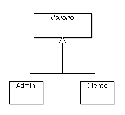

# Ejemplo 16 - Herencia de tipo _Single Table_

Utilizaremos este segundo tipo de herencia en aquellas situaciones en que tengamos una jerarquía de herencia en la que las clases hijas no añaden atributos nuevos, o añaden muy pocos (uno o dos, como mucho). A nivel de base de datos, todas las clases de la jerarquía se mapean en una sola tabla.

Sea el diseño de clases de nuestro ejemplo:



## Paso 1: Clase Base

**En este caso, la clase base `Usuario` es abstracta, pero no tiene porqué serlo**:

```java
// Resto de anotaciones
@Entity
@Inheritance(strategy = InheritanceType.SINGLE_TABLE)
public abstract class Usuario {

	@Id
	@GeneratedValue
	private long id;
	
	private String fullName;
	
	private String username;
	private String password;
	
	// Resto de métodos
	
}

```

Podemos comprobar como hemos incorporado la anotación `@Inheritance`, que indica que esta entidad será la base para una herencia. Como estrategia, elegimos `SINGLE_TABLE`, para que esta entidad y sus derivadas queden reflejadas en el DDL como una sola tabla.


## Paso 2: Clases hijas

Para cada una de las clases hijas, creamos una entidad que extiende la clase base:

```java
// Resto de anotaciones
@Entity
@DiscriminatorValue("A")
public class Admin extends Usuario {

	// Resto de métodos	
}
```

```java
// Resto de anotaciones
@Entity
@DiscriminatorValue("C")
public class Cliente extends Usuario{

	// Resto de métodos
	
}
```

Podemos comprobar como en este ejemplo, las clases hijas `Admin` y `Cliente` no añaden ningún atributo nuevo (pero lo podrían hacer). Sin embargo, si vemos el DDL generado:

```sql
create table usuario (
	dtype varchar(31) not null, 
	id bigint not null, 
	full_name varchar(255), 
	password varchar(255), 
	username varchar(255), 
	primary key (id)
)
```

Podemos comprobar como JPA ha añadido una columna adicional, llamada DTYPE. Esta columna es la que nos permitirá almacenar un valor que _discrimine_ o diferencie los distintos tipos de `Usuario`. Por defecto, se usa el nombre de la entidad, pero podemos establecer un valor a través de la anotación `@DiscriminatorValue`, tal y como hemos hecho en el ejemplo.

## Paso 3: ¿Es necesario el repositorio / servicio de la clase base?

Con la práctica podremos comprobar como la herencia no tiene una única solución; en nuestro caso, estamos implementando un fragmento de un diagrama UML mayor, y las posibles asociaciones del resto de clases con las representadas en este problema, podrían hacer que tomáramos una alternativa diferente.

Una de las preguntas que debemos hacernos es si vamos a necesitar manejar, de alguna forma, instancias de la clase base `Usuario`. En principio, en este ejemplo no necesitaremos crear entidades de este tipo, aunque _sí que nos gustaría poder obtener un listado de todos los usuarios_, ya sean clientes o administradores. Además, queremos aprovechar la potencia de los repositorios de Spring Data JPA para disponer de un método de consulta, _findByUsername_, tanto para los clientes como para los administradores, sin tener que "implementarlo" en ambos repositorios.

**Si deseamos definir un repositorio base, del cual extenderemos**, pero que **no vamos a usar directamente**, podemos usar la anotación `@NoRepositoryBean`. Esta anotación indica a Spring que no debe crear el _bean_ para este repositorio.

```java
@NoRepositoryBean
public interface BaseUsuarioRepository<T extends Usuario> extends JpaRepository<T, Long> {
	
	public T findByUsername(String Username);

}
```

## Paso 4: Repositorios y servicios

Definimos ahora el resto de repositorios y servicios. Los repositorios extenderán, en este ejemplo, a `BaseUsuarioRepository`, para _heredar_ el método de consulta definido en él:

```java
public interface ClienteRepository extends BaseUsuarioRepository<Cliente>{

}
```

```java
public interface AdminRepository extends BaseUsuarioRepository<Admin> {

}
```

Creamos ahora los servicios. En primer lugar, podemos crear un **servicio base de usuarios**, que incluya la consulta por _username_.

```java
public abstract class BaseUsuarioService<T extends Usuario, R extends BaseUsuarioRepository<T>> extends BaseService<T, Long, R>{

    public T findByUsername(String username) {
        return repositorio.findByUsername(username);
    }

}
```

A partir de este, podemos definir nuestros servicios.


```java
@Service
public class ClienteService extends BaseUsuarioService<Cliente, ClienteRepository> {
}
```

```java
@Service
public class AdminService extends BaseUsuarioService<Admin, AdminRepository> {
}
```

### Paso 4.1: Servicio para la clase `Usuario`

Si bien aprenderemos el manejo de consultas más adelante, no quiero dejar la oportunidad de presentar una posibilidad que tenemos. En este ejemplo, la clase `Usuario` es abstracta, pero puede interesarnos (por ejemplo, para la implementación de la función de _login_), querer hacer consultas sobre dicha entidad.

Un forma de solucionarlo, y dado que no hemos querido crear un repositorio, es a través de un servicio que implemente consultas (por ejemplo, con JPQL).

El código de ejemplo sería el siguiente:

> El uso de consultas lo aprenderemos más adelante

```java
@Service
public class UsuarioService {

    @Autowired
    EntityManager entityManager;


    public Optional<Usuario> findUsuarioByUsername(String username) {

        Optional<Usuario> result = Optional.empty();

        TypedQuery<Usuario> query =
                entityManager.createQuery("select u from Usuario u where u.username = :username",
                        Usuario.class);

        try {
            Optional.of(query.setParameter("username", username).getSingleResult());
        } catch (NoResultException | NonUniqueResultException ex) {
            result = Optional.empty();
        }

        return result;


    }

    public List<Usuario> findThemAll() {

        List<Usuario> result = null;

        TypedQuery<Usuario> query = entityManager.createQuery("select u from Usuario u", Usuario.class);

        try {
            result = query.getResultList();
        } catch (NoResultException e) {
            result = null;
        }

        return result;
    }

}


```