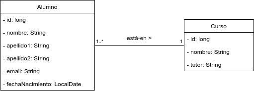

# Ejemplo 19 - Consultas con Spring Data JPA: JPQL

## Modelo de datos

Partimos de un modelo de datos como el del ejemplo anterior



## JPQL

Al igual que los sistemas gestores de bases de datos relacionales tienen SQL como lenguaje de consulta, JPA tiene su propio lenguaje de consulta, llamado JPQL. 

JPQL es usado para hacer consultas contra las entidades almacenadas en una base de datos relacional. Está inspirado en gran medida por SQL, y sus consultas se asemejan a las consultas SQL en la sintaxis, pero opera con objetos entidad de JPA en lugar de hacerlo directamente con las tablas de la base de datos.

Además de recuperar objetos (consultas `SELECT`), JPQL soporta consultas de actualización (`UPDATE`) y borrado (`DELETE`).

JPQL está basado en Hibernate Query Language (HQL), un lenguaje de consulta anterior no estándar incluido en la biblioteca de mapeo objeto-relacional Hibernate.

Hibernate y HQL se crearon antes de la especificación JPA. Hasta la versión Hibernate 3, JPQL es un subconjunto de HQL.

## Sintáxis de JPQL

En este [enlace](https://www.objectdb.com/java/jpa/query/jpql/structure) podemos encontrar un amplio tutorial sobre la sintaxis que podemos utilizar en JPQL. Dejamos por aquí un pequeño resumen.

Una sentencia JPQL tiene la siguiente sintaxis:

```sql
SELECT ... FROM ...
[WHERE ...]
[GROUP BY ... [HAVING ...]]
[ORDER BY ...]
```

Son obligatorias las dos primeras cláusulas. El resto, son optativas.

Para sentencias `UPDATE` y  `DELETE` es más sencillo:

```sql
DELETE FROM ... [WHERE ...]

UPDATE ... SET ... [WHERE ...]
```

Aparte de tan solo unas pequeñas excepciones, JPQL no es sensible al uso de mayúsculas/minúsculas.

### Claúsula `SELECT`

#### Sentencia `SELECT` mínima

```sql
SELECT c FROM Country c
```

#### Uso de `DISTINCT`

El uso de `DISTINCT` tiene el mismo efecto que en SQL. 

```sql
SELECT DISTINCT c FROM Country c WHERE c.name LIKE 'I%'
```


### Claúsula `FROM`

En la claúsula `FROM` identificamos las entidades sobre las que vamos a realizar la consulta. Podemos incluir más de una entidad separando por comas

```sql
SELECT c1, c2 FROM Country c1, Country c2
WHERE c2 MEMBER OF c1.neighbors
```

#### Tipos de `JOIN`: `INNER JOIN`, `OUTER JOIN`y _`JOIN FETCH`_

Al igual que SQL, JPQL dispone la posibilidad de realizar la _reunión_ de más de una tabla. Si se quiere conocer las operaciones de JOIN normal o lateral se puede visitar la bibliografía. Explicamos aquí una opción interesante que es `JOIN FETCH`

JPA nos ofrece una navegación transparente entre objetos, lo cual nos ofrece la ilusión de que tenemos todas las instancias de las diferentes entidades en memoria para navegar entre ellas. Sin embargo, esto no es del todo real, y si lo llegamos a implementar con asociaciones cuyo tipo de _fetching_ sea siempre _EAGER_, el rendimiento bajará disparado.

Supongamos que tenemos una entidad `Country`, asociada con otra entidad `Capital`. Si queremos, explícitamente, obtener la capital del país, a la vez que obtenemos el país, podemos hacer un `JOIN FECTH`.

```sql
SELECT c FROM Country c JOIN FETCH c.capital
```

`JOIN FETCH` tiene como único propósito _recuperar objetos asociados_ en una misma consulta. Si lo implementamos así, ganaremos en eficiencia.


### Claúsula `WHERE`

Sirve para establecer condiciones que deben cumplir las entidades para ser obtenidas como resultado de la consulta. Esta cláusula espera un predicado. Su sintaxis es muy similar a la de SQL.

```sql
SELECT c FROM Country c WHERE c.population > 50000000
```

Las posibilidades de esta claúsula son muy grandes. Para más información puedes consultar [aquí](https://www.objectdb.com/java/jpa/query/jpql/expression).

### Polimorfismo y _downcasting_

En este apartado usamos el esquema del ejemplo de Joined.

> La expresión _downcasting_ o _refinado de tipo_ significa realizar un _casting_ de una referencia de una clase base a una de sus clases derivadas  

Cuando utilizamos un esquema de herencia que soporta consultas polimórficas, nuestras sentencias `SELECT` tomarán todas las instancias de la clase base, así como de las subclases.

La siguiente consulta 

```sql
SELECT c FROM Cliente c
```

nos devolvería todas las instancias de `Cliente`, así como sus subclases.

Desde JPA 2 se puede utilizar el operador `TYPE`, que nos permite filtrar por el tipo de una entidad. 

```sql
select c from Cliente c where TYPE(c) = Cliente
```

Esta consulta solo nos devolvería las instancias del tipo base.


## Uso de JPQL _al estilo JPA_

Podemos utilizar consultas JPQL de dos formas diferentes:

1. Lanzando la consulta a través de un objeto `javax.persistence.Query` o `javax.persistence.TypedQuery<T>`. La utilización de esta clase la haríamos directamente en un servicio. A este lo llamamos _estilo JPA_.
2. Utilizando la anotación `@Query` sobre un método de un repositorio. A este lo llamamos el _estilo Spring Data JPA_.

En este apartado vamos a conocer el primero de ellos.

Si revisitamos el [ejemplo 24](https://github.com/lmlopezmagana/bbdd-2019/tree/master/24_Herencia_SingleTable), podemos encontrar un ejemplo de uso de JPQL con `TypedQuery`:

```java
@Service
public class UsuarioServicio {

	@Autowired
	EntityManager entityManager;

	// Resto del código

	public List<Usuario> findThemAll() {

		List<Usuario> result = null;

		TypedQuery<Usuario> query = entityManager.createQuery("select u from Usuario u", Usuario.class);

		try {
			result = query.getResultList();
		} catch (NoResultException e) {
			result = null;
		}

		return result;
	}

}

``` 

Podemos observar los siguientes aspectos:

1. Necesitamos una instancia de `EntityManager` para poder crear la consulta. Este objeto especial es nuestro [**contexto de persistencia**](https://javaee.github.io/javaee-spec/javadocs/javax/persistence/EntityManager.html).
2. Al crear la consulta, indicamos el tipo de dato que nos va a devolver a través del segundo método de `createQuery`. Dicho tipo debe coincidir con el tipo de dato resultado del `TypedQuery` creado.

## Uso de JPQL _al estilo Spring Data JPA_

Spring Data JPA nos ofrece, entre otras facilidades, la posibilidad de utilizar la anotación `@Query`, que funciona de la siguiente forma: 

1. Definimos un método en uno de nuestros repositorios.
2. Anotamos dicho método con `@Query`
3. Dentro de la anotación, indicamos la consulta JPQL.

Un ejemplo podría ser el siguiente:

```java
@Query("select a from Alumno a where a.curso is null")
public List<Alumno> encuentraAlumnoSinCurso();
``` 

### Uso de parámetros en las consultas

Al igual que en el ejemplo anterior, podemos utilizar variables como parámetros en las consultas (por ejemplo, esto nos serviría para implementar un buscador). Para ello debemos:

1. Escribir una consulta JPQL que tenga condiciones en la cláusula `WHERE`.
2. A cada parámetro, le daremos un nombre, que tendrá como prefijo el caracter dos puntos `:`.
3. El método que tenga la anotación `@Query` con la consulta recibirá tantos argumentos como hayamos definido en la consulta. Para hacer la asignación de cada parámetro en la consulta con los argumentos del método, utilizamos la anotación `@Param`.

> La anotación `@Param` no es necesaria si el _token_ utilizado para definir el argumento en la consulta coincide con el nombre del parámetro que recibe el método.

Un ejemplo podría ser este:

```java
@Query("select a from Alumno a where fecha_nacimiento >= :fechaNacimiento and a.curso = :curso")
public List<Alumno> alumnosNacidosDespuesDe(@Param("fechaNacimiento") LocalDate fechaNacimiento, @Param("curso") Curso curso);
```


## Bibliografía

- [https://es.wikipedia.org/wiki/Java_Persistence_Query_Language](https://es.wikipedia.org/wiki/Java_Persistence_Query_Language)
- [https://www.petrikainulainen.net/programming/spring-framework/spring-data-jpa-tutorial-creating-database-queries-with-the-query-annotation/](https://www.petrikainulainen.net/programming/spring-framework/spring-data-jpa-tutorial-creating-database-queries-with-the-query-annotation/)
- [https://www.objectdb.com/java/jpa/query/jpql/structure](https://www.objectdb.com/java/jpa/query/jpql/structure)
- [https://thoughts-on-java.org/jpql/](https://thoughts-on-java.org/jpql/)