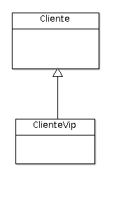

# Ejemplo 17 - Ejemplo de uso de herencia de tipo JOINED

El tercer tipo de estrategia que vamos a conocer es _JOINED_, o también conocido como _table per subclass_. En este caso, JPA va a generar una tabla para la clase _base_, con todos sus atributos; y también una tabla para cada una de las subclases, que incluirá una clave externa a la tabla de la clase base, así como los posibles atributos propios que tenga.

## Ejemplo

Sea el siguiente diagrama de clases



En este caso, nos interesa poder tener instancias de ambas entidades: tendremos clientes y clientes vip.

## Paso 1: Clase `Cliente`

Se parece mucho a otras entidades que hemos hecho en ejemplos anteriores. Tan solo cambiamos el tipo de herencia a utilizar.

```java
//Resto de anotaciones
@Entity
@Inheritance(strategy = InheritanceType.JOINED)
public class Cliente {

	@Id
	@GeneratedValue(strategy = GenerationType.AUTO)
	private long id;
	
	private String email;
	
	private String nombre;
	private String apellidos;
	
}

```

## Paso 2: Clases hijas

En este caso solamente tenemos una clase hija. El código también es similar al de ejemplos anteriores:

```java
// Resto de anotaciones
@Entity
public class ClienteVip extends Cliente {

	private LocalDate fechaVip;
	
}

```

En este caso, `ClienteVip` añade un nuevo atributo.

# Paso 3: Repositorios y servicios.

En anteriores ejemplos hemos seguido la tónica de que cada entidad tuviera su repositorio y su servicio. Esto no es un axioma, aunque al final en este ejemplo seguiremos esa dinámica. Sin embargo, podríamos crear solamente un repositorio para la clase base. De hecho, si probamos a insertar un `ClienteVip` a traves del repositorio de cliente, tenemos el siguiente DML:

```sql
insert into cliente (apellidos, email, nombre, id) values (?, ?, ?, ?)
insert into cliente_vip (fecha_vip, id) values (?, ?)
```

_Con todo, como decíamos, seguimos usando el mismo esquema de trabajo de anteriores ejemplos, y crearemos un repositorio y servicio para `Cliente` y otro para `ClienteVip`_.

```java
public interface ClienteRepository extends JpaRepository<Cliente, Long>{

	@Query("select c from Cliente c where TYPE(c) = Cliente")
	public List<Cliente> clientesNoVip();

}
```

```java
public interface ClienteVipRepository extends JpaRepository<ClienteVip, Long>{
	
	List<ClienteVip> findByFechaVipBetween(LocalDate fechaVipStart, LocalDate fechaVipEnd);

}

```

Se propone una consulta por cada repositorio, entre otras cosas, para darle sentido a la existencia de cada repositorio, si bien las consultas serán explicadas más adelante.

Los servicios serían como solemos implementarlos usualmente.


